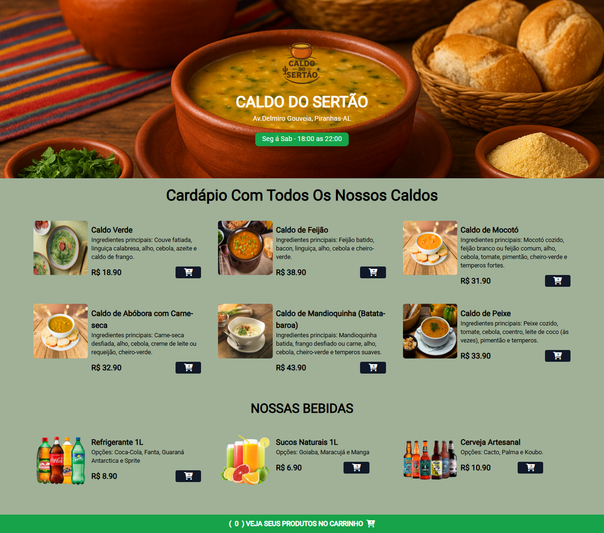

# 🍲 Caldo do Sertão - Cardápio Online

Este é um projeto simples desenvolvido apenas com **HTML** para exibir o cardápio da loja **Caldo do Sertão**, localizada em **Piranhas - Alagoas**.  

O objetivo foi criar uma página única (`index.html`) apresentando os caldos e bebidas disponíveis, simulando um cardápio digital que pode ser utilizado em sites ou telões.

---

## 📸 Prévia do Projeto


---

## 📋 Funcionalidades

- Exibição de todos os caldos disponíveis com preços e ingredientes principais.
- Exibição de bebidas disponíveis.
- Estrutura organizada em seções:
  - **Caldos**
  - **Bebidas**
- Botões de "Adicionar ao Carrinho" (apenas ilustrativos, sem backend).
- Horário de funcionamento em destaque.

---

## 🛠️ Tecnologias Utilizadas
- **HTML5**
- **CSS3 (inline e estilos básicos)**

---

## 🚀 Como Executar

1. Clone este repositório:
   ```bash
   git clone https://github.com/seu-usuario/caldo-do-sertao.git
